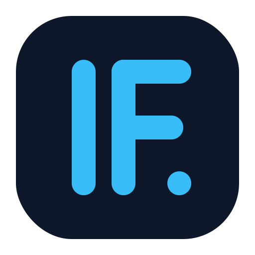
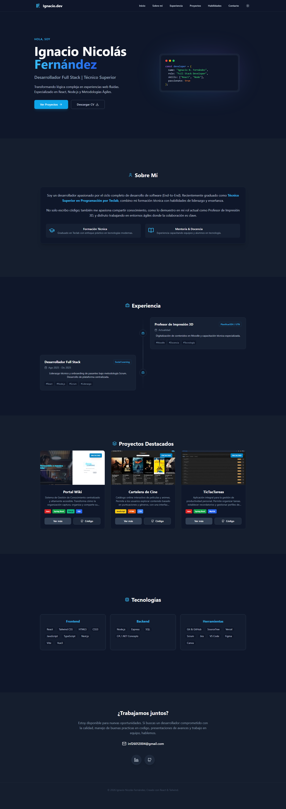

<div align="center">
  <a href="https://ignacio-fernandez-dev.vercel.app" target="_blank">
    
  </a>

  <h1 align="center">Portafolio Personal | Ignacio Nicolás Fernández</h1>

  <p align="center">
    <strong>Desarrollador Full Stack & Técnico Superior en Programación</strong>
    <br />
    Un espacio digital moderno, minimalista y altamente interactivo para exhibir mi trayectoria y proyectos.
    <br />
    <br />
    <a href="https://ignacio-fernandez-dev.vercel.app"><strong>🚀 Ver Demo en Vivo</strong></a>
    ·
    <a href="https://github.com/TU_USUARIO/portfolio/issues">Reportar Bug</a>
    ·
    <a href="#-contacto">Contactar</a>
  </p>
  
  <p align="center">
    
    
    
    
  </p>
</div>

<details>
  <summary>Tabla de Contenidos</summary>
  <ol>
    <li><a href="#-sobre-el-proyecto">Sobre el Proyecto</a></li>
    <li><a href="#-características-clave">Características Clave</a></li>
    <li><a href="#-tecnologías-utilizadas">Tecnologías</a></li>
    <li><a href="#-instalación-y-uso">Instalación y Uso</a></li>
    <li><a href="#-contacto">Contacto</a></li>
  </ol>
</details>

---

## 📸 Captura de Pantalla

<div align="center">
  
</div>

---

## 💡 Sobre el Proyecto

Este portafolio representa mi evolución como desarrollador, diseñado bajo la filosofía **"Mobile First"** y principios de **Clean Code**.

No es solo una tarjeta de presentación estática; es una aplicación web progresiva (SPA) que demuestra el manejo de estado complejo, renderizado condicional y una experiencia de usuario (UX) pulida. Incluye un sistema de temas (Oscuro/Claro) persistente y navegación fluida.

---

## ✨ Características Clave

- **🌗 Modo Oscuro/Claro:** Sistema de temas inteligente que detecta la preferencia del sistema operativo y permite el cambio manual, persistiendo la elección del usuario.
- **📱 Diseño 100% Responsive:** Adaptabilidad perfecta desde móviles pequeños hasta pantallas de escritorio.
- **⚡ Performance Optimizada:** Carga instantánea gracias a Vite y optimización de activos.
- **🖼️ Modales Interactivos:** Visualización detallada de proyectos sin recargar la página ni perder el contexto de navegación.
- **📨 Magic Mail Link:** Integración directa con Gmail API para facilitar el contacto sin fricción.
- **🎨 Animaciones Suaves:** Transiciones de entrada y efectos hover utilizando `Framer Motion` y CSS nativo.
- **🔍 Accesibilidad:** Estructura semántica y contrastes cuidados para una mejor legibilidad.

---

## 🛠 Tecnologías Utilizadas

Un stack moderno enfocado en escalabilidad y experiencia de desarrollador:

- **Core:** [React 18](https://reactjs.org/) (Hooks, Custom Hooks)
- **Lenguaje:** [TypeScript](https://www.typescriptlang.org/) (Seguridad de tipos)
- **Estilos:** [Tailwind CSS](https://tailwindcss.com/) (Utility-first)
- **Iconos:** [Lucide React](https://lucide.dev/)
- **Build Tool:** [Vite](https://vitejs.dev/)
- **Animaciones:** Framer Motion & CSS Transitions

---

## 🚀 Instalación y Uso

¿Quieres ver el código o probarlo en tu máquina? Sigue estos pasos:

1.  **Clonar el repositorio**

    ```bash
    git clone [https://github.com/TU_USUARIO/portfolio.git](https://github.com/TU_USUARIO/portfolio.git)
    ```

2.  **Instalar dependencias**

    ```bash
    cd portfolio
    npm install
    ```

3.  **Iniciar servidor local**

    ```bash
    npm run dev
    ```

4.  **Generar build de producción**
    ```bash
    npm run build
    ```

---

## 📂 Estructura del Proyecto

```text
src/
├── components/       # Componentes modulares (Navbar, Hero, Projects...)
├── assets/           # Recursos estáticos importados
├── App.tsx           # Layout principal y lógica de estructura
├── index.css         # Configuración de Tailwind y estilos globales
└── main.tsx          # Punto de entrada de React
public/
├── logo.svg          # Identidad de marca
└── cv-ignacio.pdf    # Currículum descargable
```

## 📬 Contacto

¿Te interesa mi perfil o quieres colaborar en un proyecto?

<div align="center">
  <a href="https://mail.google.com/mail/?view=cm&fs=1&to=inf26012004@gmail.com" target="_blank">
    
  </a>
  
  <a href="https://linkedin.com/in/TU_USUARIO" target="_blank">
    
  </a>
  
  <a href="https://github.com/TU_USUARIO" target="_blank">
    
  </a>
</div>

---

<div align="center">
  <p>Desarrollado con ❤️ y ☕ por <strong>Ignacio Nicolás Fernández</strong></p>
  <p>© 2024 - Todos los derechos reservados.</p>
</div>
